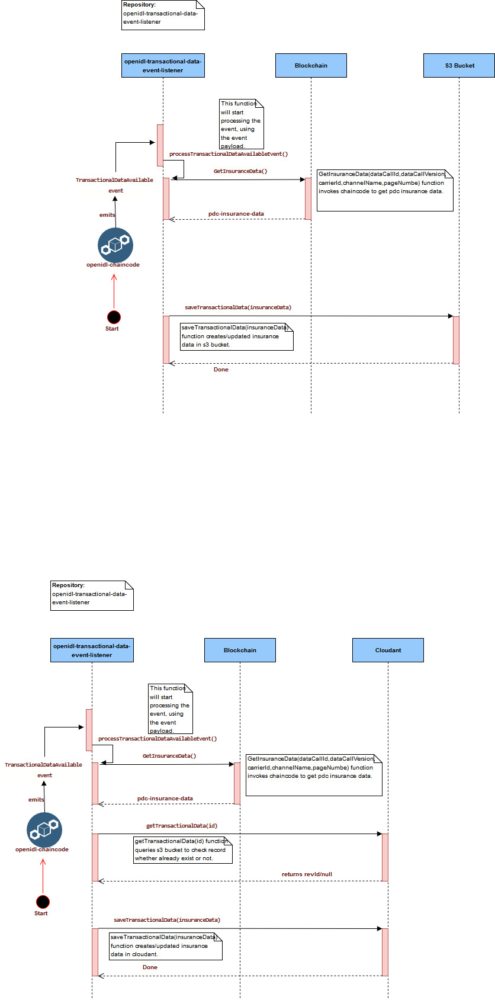

# openidl-transactional-data-event-listener

[](https://aws.amazon.com/)
[](https://nodejs.org)

This repository contains component responsible for listening to `TransactionalDataAvailable` event emitted from chaincode. As a result of this event the component fetches transactional data from private data collection and stores into an off-chain storage (i.e Cloudant or S3 Bucket). Please note that component is implemented as a Node.js application, which also serves as a Hyperledger Fabric client for submitting transactions to blockchain ledger. Therefore, this application has a dependency on the [Hyperledger Fabric SDK for Node.js](https://fabric-sdk-node.github.io/).

The openIDL Transactional Data Manager provides functionality for:

* Listening to `TransactionalDataAvailable` event

* Invoking chaincode to get insurance transactional data from private data collection and storing in Cloudant (off-chain database)

## Running Transactional Data Listener locally

For development, testing, and debugging purposes, it is very convenient to run this Node.js component locally on your system and have it connect to the local blockchain network.

## Installing NodeJS
If you do not have Node.js installed already, [download](https://nodejs.org/en/download/releases/) and install Node.js v14.17.x (please note that other Node.js versions may not be compatible with this codebase). Also, make sure that the npm version you have is v6.14.x

## Get Repository code into local machine

* Open a command line terminal at the location of project has to be created : `git clone git@github.com:openidl-org/openidl-main.git `
* Example of develop branch : `git checkout -b develop`

## Installing openidl-common-lib npm module 
This repository leverages common functionality from [openidl-common-lib](https://github.com/openidl-org/openidl-main/tree/main/openidl-common-lib) . To install this dependency, replace `{GITHUB_TOKEN}` in `.npmrc` with your own Git personal access token. For details on how to get an access token, please see [Personal access tokens](https://docs.github.com/en/github/authenticating-to-github/keeping-your-account-and-data-secure/creating-a-personal-access-token) on the GitHub site. Access Token should have at least `read:packages` permissions

## Configure to Run locally

For development, testing, and debugging purposes, it is very convenient to run this Node.js component locally on your system and have it connect to the local blockchain network.

### 1. Configure connection-profile.json

* Run the `./start.sh` script in the `openidl-test-network` folder
* This will launch a Hyperledger Fabric Network with 3 Organizations (AAIS, Analytics & Carrier)
* Create connection-profile.json file under server/config
* Copy the contents from `openidl-test-network/organizations/peerOrganizations/aais.example.com/connection-aais.json` to connection-profile.json
* Replace `host.minikube.internal` with `localhost` in connection-profile.json

### 2. Configure local-db-config.json

* Edit `local-db-config.json` file under `server/config`
* Paste the following JSON in `local-db-config.json` file
    ``` 
    {
        "persistentStore": "mongo",
        "mongodb": "openidl-offchain-db",
        "simpleURI": "mongodb://localhost:27017"
    }
    ```
* Application will be using local MongoDB running on port `27017` as the persistent data store

### 3. listener-channel-config.json

* Create listener-channel-config.json file under server/config
* Below is an example of AAIS node

|   Config File Name      | Configured Value  |  Local Run Value|
|  --------------------- | ----------------- | --------------- |
|   `server/config/listener-channel-config.json` | `"listenerChannels": "${LISTENER_CHANNELS_EVENTS}"` | `"listenerChannels": [{"channelName":"analytics-aais","events":[{"TransactionalDataAvailable":"processTransactionalDataAvailableEvent"}]}]` |

### 4. target-channel-config.json

* Create target-channel-config.json file under server/config
* Below is an example of AAIS node

|   Config File Name      | Configured Value  |  Local Run Value|
|  --------------------- | ----------------- | --------------- |
|   `server/config/target-channel-config.json` | `"targetChannels": "${TARGET_CHANNELS}"` | `"targetChannels": [{"channelName":"analytics-aais","chaincodeName":"openidl-cc-aais-carriers"}]` |

### 7. Configure s3-bucket-config.json

* s3 is an object storage in AWS cloud. Currently, openidl application is configured to place all the carrier insurance data(for the data call) in this bucket
* Create s3-bucket-config.json file under server/config
* The JSON structure for this file is as below:
    ```
    {
      "accessKeyId": "XXXXXXXXXXXXXXXXXXXX",
      "secretAccessKey": "XXXXXXXXXXXXXXXXXXXXXXXXXXXXXXXXXXXXX",
      "bucketName": "openidl-analytics"
    }
    ```
* The access key ID and  secret access key are obtained from AWS
* Currently, the credentials provided by AAIS are used by all the environments including dev, test and prod. In future, it needs to have separate buckets and credentials for each environment.
* Due to above reasons, this file is not checked in to git. Get this file from admins or get it from the Kuberenetes secrets in analytics node

### Start the Node.js server

1. Run the `npm install` command and verify that there are no errors.
2. Run the `npm start` command.
3. Verify that the server has started successfully. The message `[2018-11-26 16:34:00.581] [INFO] server - app listening on http://localhost:3000` should be present in the logs, and there should be no errors.

### Verify server is up and running

You can access `http://localhost:3000/health` locally to check server is up and running and you will get a message `{"message":"Data call transactional event listener is alive."}`

### Execute functional test cases

Once the installation and application have been verified to work locally, test suites may be executed:

1. Ensure that the current app has been stopped (Ctrl+C on macOS/Unix machines).
2. Run the `npm test` command.
3. Ensure that output does not contain any errors.

If errors are present, see the [troubleshooting section](#troubleshooting).

### Troubleshooting

If there are errors, please inspect the logs carefully and debug accordingly. Common errors may relate to:

* Connection not being established to the local blockchain network.
* Node/npm packages not being installed correctly.
* Multiple instances of the application running and trying to use the same network port.

### Sequence Diagram 
Sequence diagram [draw.io](hhttps://github.com/openidl-org/openidl-main/tree/main/openidl-transactional-data-event-listener/docs/transactional-data-event-listener.drawio) file.

